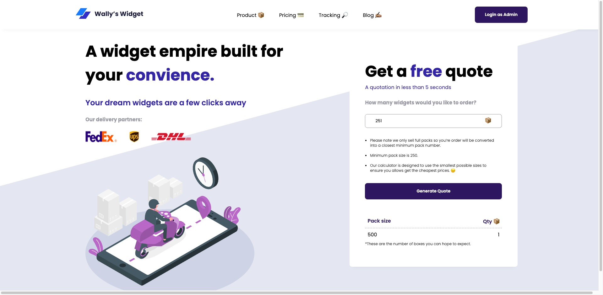

## Table of contents

- [Overview](#overview)
  - [The challenge](#the-challenge)
  - [Screenshot](#screenshot)
  - [Links](#links)
- [My process](#my-process)
  - [Built with](#built-with)
  - [Useful resources](#useful-resources)
- [Author](#author)

## Overview

### The challenge

Users should be able to fullfill orders according to the following rules:

- Only whole packs can be sent. Packs cannot be broken open.
- Within the constraints of Rule 1 above, send out no more widgets than necessary to fulfil the order.
- Within the constraints of Rules 1 & 2 above, send out as few packs as possible to fulfil each order.

Non-functional requirements

- View the optimal layout for the site depending on their device's screen size

### Design for the page

### Screenshot of implemented solution

### Links

- Solution URL: [Add solution URL here](https://your-solution-url.com)
- Live Site URL: [Live solution URL](https://walley-widget.vercel.app)

## My process

### Built with

- Semantic HTML5 markup
- CSS custom properties
- Flexbox
- [Angular](https://reactjs.org/) - JS Framework
- [Figma] (https://www.figma.com/file/lEP12ir1TxqAeznEhyjjdf/Walley's-Widget?node-id=0%3A1) - For High fidelity design

### Useful UX resources

- [Dribbble](https://dribbble.com/) - This helped me get some design inspirations for the UI.
- [Figma](https://www.figma.com/) - This is a useful that allowed me to designing UI interface.

## Author

- Website - [Joey Malope](https://www.your-site.com)

## Development server

Run `ng serve` for a dev server. Navigate to `http://localhost:4200/`. The application will automatically reload if you change any of the source files.

## Build

Run `ng build` to build the project. The build artifacts will be stored in the `dist/` directory.
